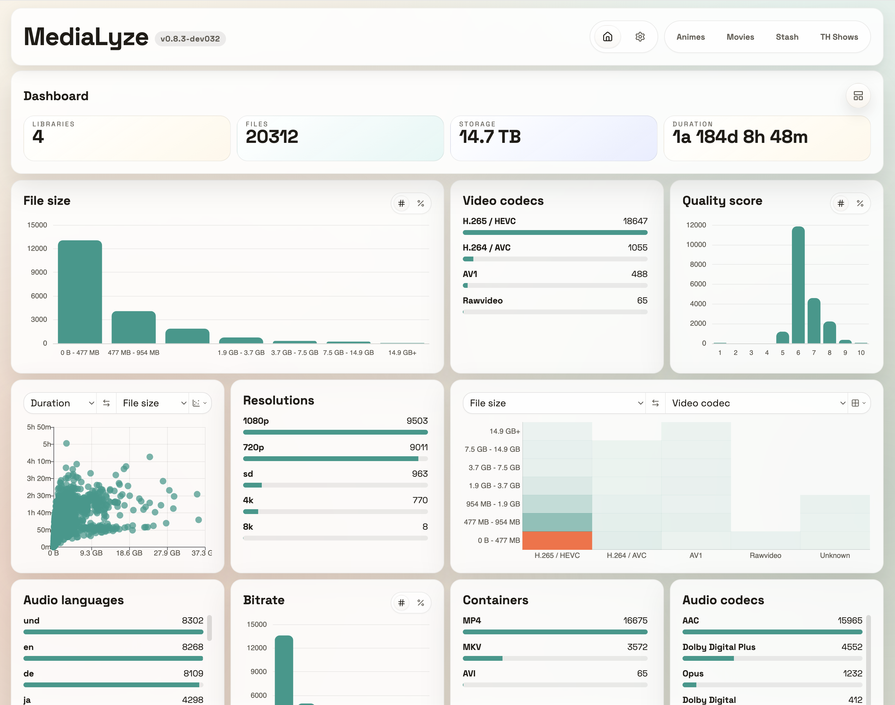
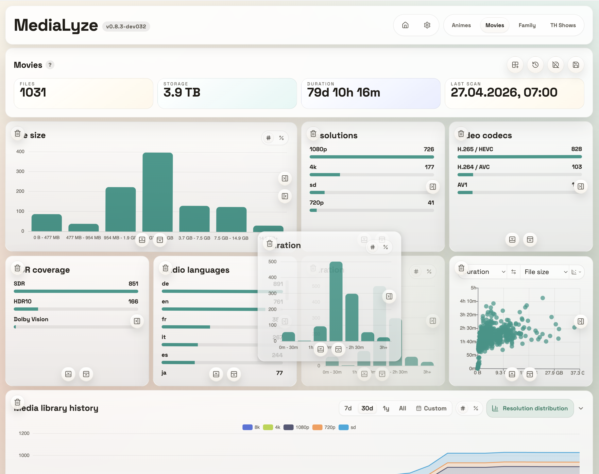
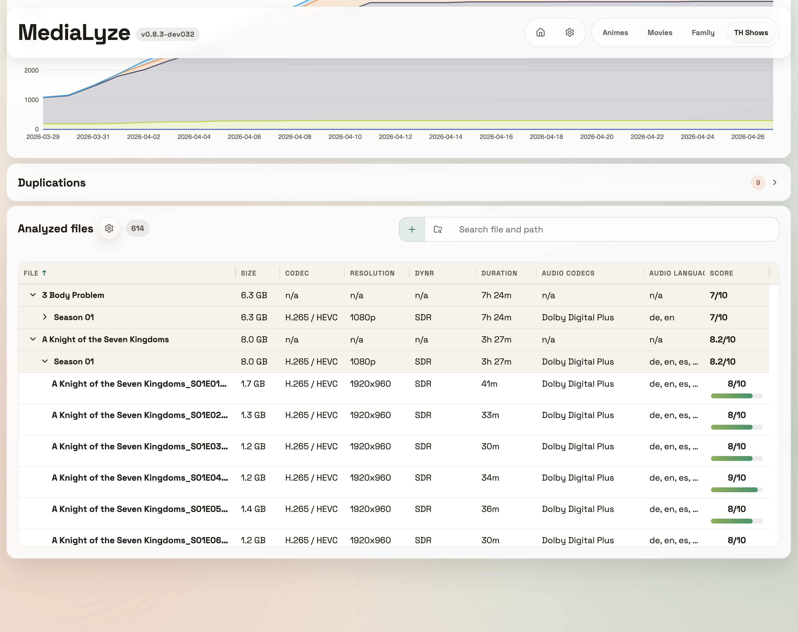
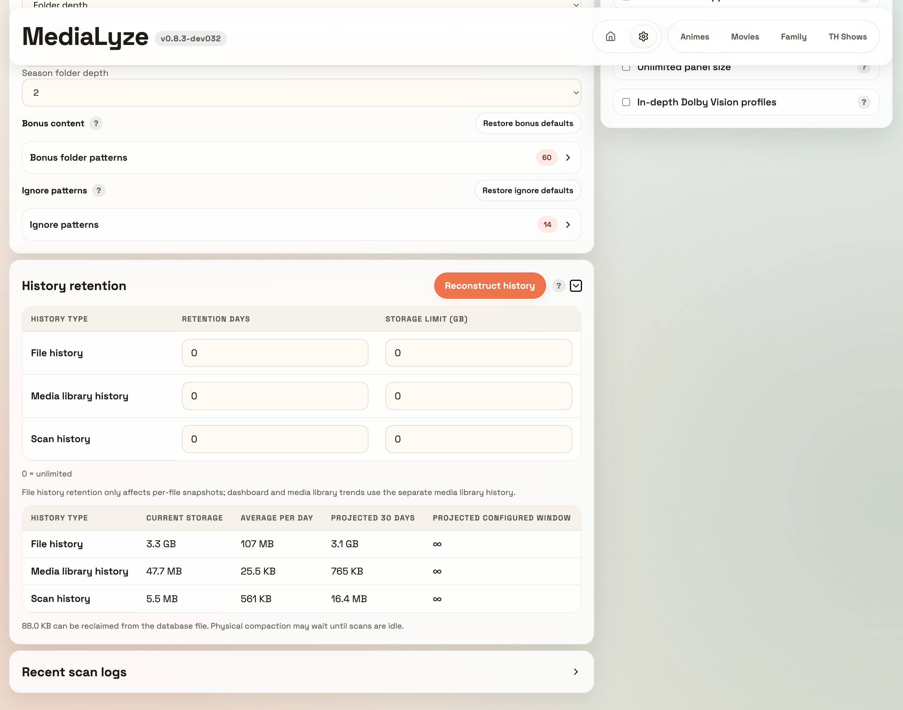

# MediaLyze

<p align="center">
  <a href="./LICENSE"></a>
  
  
  
  
  
  
</p>

<p align="center">
  Self-hosted media library analysis for large video collections.
  Scans your libraries and run analyses using <code>ffprobe</code>.
  Explore technical metadata through a FastAPI + React web UI.
</p>

<p align="center">
  MediaLyze focuses (for now) on just analysis, not playback, scraping, or file modification, READ ONLY on your files!
</p>



## Why MediaLyze

MediaLyze is built for self-hosted setups that need visibility into large media collections without depending on external services and designed around ffprobe with normalized metadata.

Everything with a simple deployment model: one container, one SQLite database, one UI.
Bring your own auth (for now).

## Features

- Technical media analysis powered by `ffprobe`
- Full and incremental scans using `path + size + mtime`
- historical analysis
- many different charts for all metrics
- Normalized formats, streams, subtitles, scan jobs, and quality scores (feel free to suggest improvements)
- recognize shows, seasons, bonus content
- Ignore files and folders with simple glob patterns such as `*.nfo` or `*/Extras/*`
- Native desktop packaging for Windows, macOS, and Linux in addition to the Docker/web deployment path
- and more

## Screenshots

<table>
  <tr>
    <td></td>
    <td></td>
  </tr>
  <tr>
    <td></td>
    <td></td>
  </tr>
</table>

## Quick Start

### Docker Compose

use the production ready docker compose file:
[docker-compose.yaml](docker/docker-compose.yaml)

```docker
services:
  medialyze:
    image: ghcr.io/frederikemmer/medialyze:latest
    container_name: medialyze
    ports:
      - 8080:8080
    environment:
      # change to your timezone, e.g. "Europe/Berlin" or "America/New_York"
      TZ: UTC
    volumes:
      - ./config:/config
      # use .env or change "./media" to the path of your media directory
      - ./media:/media:ro

      # additional media mounts, if needed. Extend this pattern if needed:
      # /PATH/TO/MEDIA1:/media/MEDIA1:ro
```

can be extended by .env using:
[docker-compose-ENV.yaml](docker/docker-compose-ENV.yaml)
and 
[env.example](docker/env.example)


Open `http://localhost:8080`.
The container serves plain HTTP on port `8080` by default - if you want HTTPS, terminate it in a reverse proxy.

#### Configuration through [Docker configuration](#docker-configuration)

---

### Desktop app

Built with Electron, desktop builds run the same FastAPI + React stack locally with a local SQLite database and `ffprobe`.

Desktop behavior:

- choose local folders directly from the OS
- choose mounted NAS / SMB locations and, on Windows, UNC paths such as `\\server\share\videos`
- watch mode is limited to local paths; network paths fall back to scheduled scans

Release artifacts are packaged as:

- Windows: `.exe`
- macOS: `.dmg`
- Linux: `AppImage`

---

### Build locally

run:
```bash
cp docker/env.example .env
docker compose -f docker-compose-dev.yaml up --build
```

The default container setup mounts:

- `./config` to `/config`
- `./media` to `/media` as read-only

If you want a different media-path, or external port change `env.example` or `.env`.

## Local Development

### Backend

```bash
python3 -m venv .venv
source .venv/bin/activate
pip install -e .[dev]
uvicorn backend.app.main:app --reload --port 8080
```

### Frontend

```bash
cd frontend
npm install
npm run dev
```

The Vite dev server proxies `/api` to `http://127.0.0.1:8080`.

### Desktop

```bash
python3 -m venv .venv
source .venv/bin/activate
pip install -e .[dev]

cd frontend
npm install
npm run build

cd ../desktop
npm install
npm run dev
```

Local desktop development expects `ffprobe` in your `PATH`.
For packaged `.app`, `.dmg`, `.exe`, and `AppImage` builds, see [docs/build_desktop.md](docs/build_desktop.md).

## Docker configuration

Relevant environment variables:

- `MEDIALYZE_RUNTIME`: runtime mode, `server` or `desktop`, default `server`
- `CONFIG_PATH`: writable config/data directory, default `/config` in server mode and the OS user-data directory in desktop mode
- `MEDIA_ROOT`: media mount root for server mode, default `/media`
- `APP_HOST`: bind host for the backend, default `0.0.0.0` in server mode and `127.0.0.1` in desktop mode
- `HOST_PORT`: HTTP port exposed on the host, default `8080`; access the app via `http://<host>:<HOST_PORT>`
- `APP_PORT`: internal app port, default `8080`
- `FRONTEND_DIST_PATH`: optional explicit frontend bundle path, mainly used by packaged desktop builds
- `TZ`: process/container timezone, default `UTC`
- `DISABLE_DEFAULT_IGNORE_PATTERNS`: optional; when set to `true`, built-in default ignore patterns are not preloaded
- `FFPROBE_PATH`: optional override for the `ffprobe` binary path
- `PUID` / `PGID`: optional runtime user/group ids for shared-folder permission setups; set both or leave both unset to keep the default root runtime user

`MEDIA_ROOT` should be mounted read-only in production.

If you need a specific runtime uid/gid, set `PUID` and `PGID` in `.env`. The compose files already load `.env`, so no compose changes are required.

For SMB / NAS setups, the recommended approach is to mount the share on the Docker host first and then point `MEDIA_HOST_DIR` at that host mount path.
In the desktop app, mounted network shares and UNC paths can be selected directly.

Scan parallelism is configured in the UI under `Settings -> App settings -> Scan performance`.
MediaLyze exposes separate limits for per-scan analysis workers and parallel library scans so you can tune throughput without editing compose or env files.

Ignore rules use glob patterns matched against the normalized relative path inside each library. MediaLyze ships editable built-in defaults for common system and temporary paths such as `*/.DS_Store`, `*/@eaDir/*`, `*/.deletedByTMM/*`, and `*.part`. Set `DISABLE_DEFAULT_IGNORE_PATTERNS=true` if you do not want those defaults preloaded on first start.
See [docs/patterns.md](docs/patterns.md) for series, bonus, and ignore-pattern rules, or [docs/ignore_files_folders.md](docs/ignore_files_folders.md) for ignore-only examples.

## Tech Stack

- Backend: Python, FastAPI, SQLAlchemy, SQLite
- Frontend: React, Vite, TypeScript, i18next
- Desktop packaging: Electron, electron-builder
- Media analysis: `ffprobe` / FFmpeg
- Scheduling and watch mode: APScheduler, watchdog
- Packaging: GHCR

## Project Status

MediaLyze is an open-source project under active development. The current focus is technical media analysis for large self-hosted libraries, with the v1 scope centered on scanning, normalization, statistics, and file inspection.

### mentioned on

>[selfh.st](https://selfh.st/weekly/2026-03-13/)\
>[ServersatHome](https://www.youtube.com/watch?v=LU5q0GzsAIk)

## Star History

[](https://www.star-history.com/?repos=frederikemmer%2Fmedialyze&type=date&legend=top-left)

## Contributing & License

Contributions are welcome. Read [CONTRIBUTING.md](CONTRIBUTING.md) before opening a pull request.

This project is licensed under the [MIT License](LICENSE).
