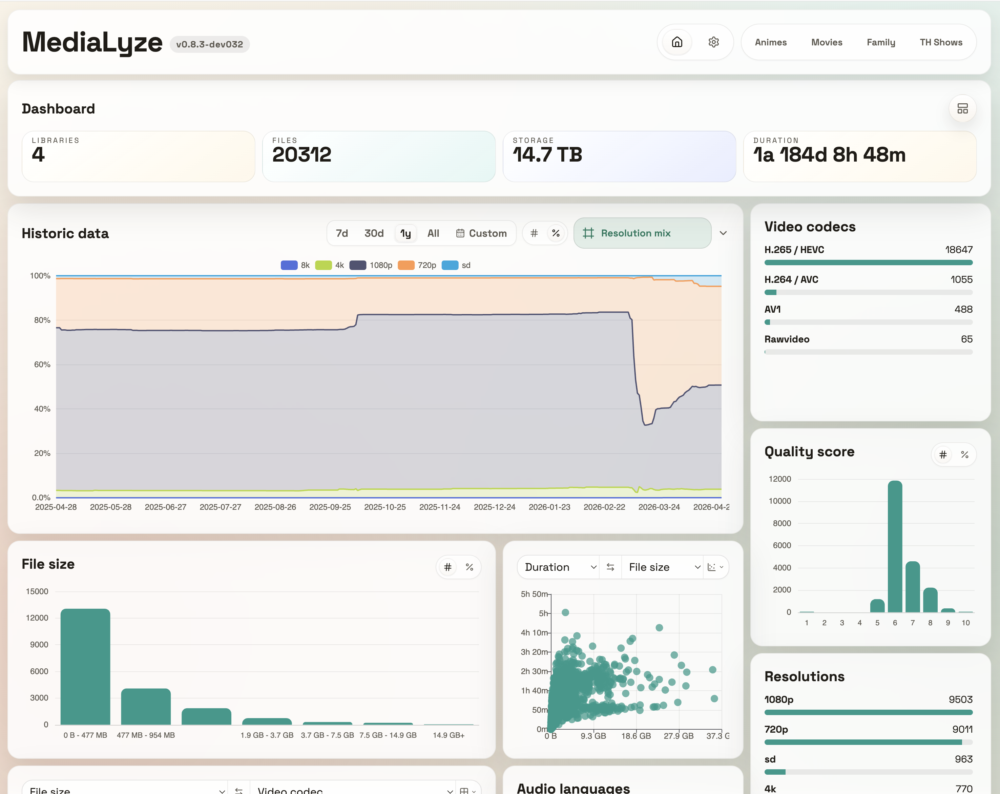
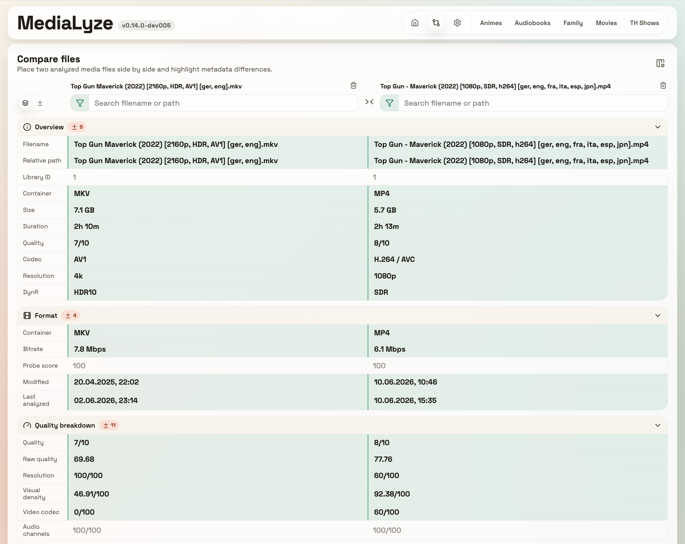
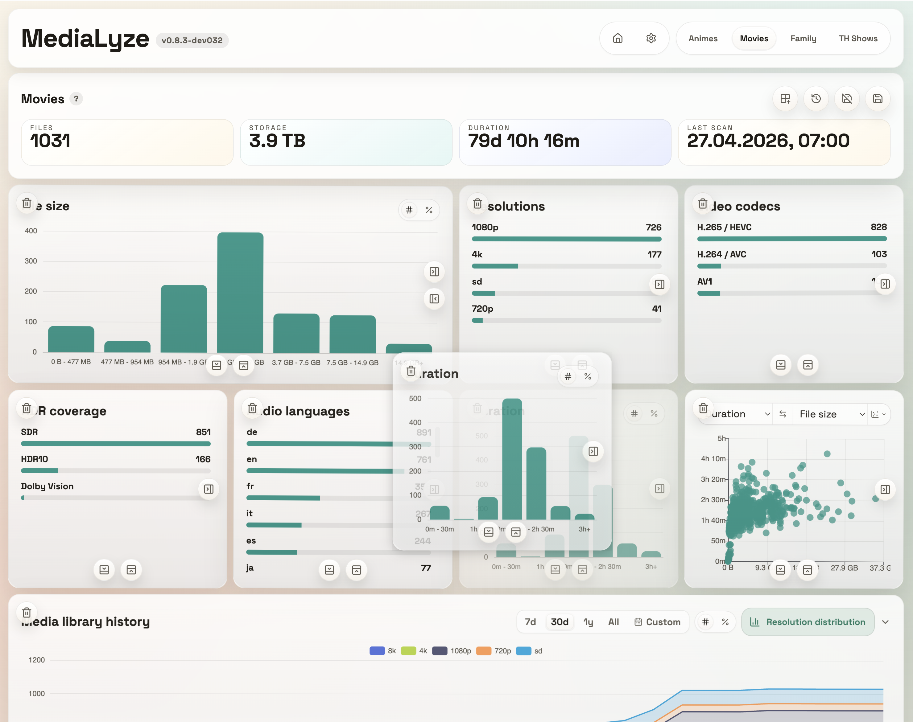
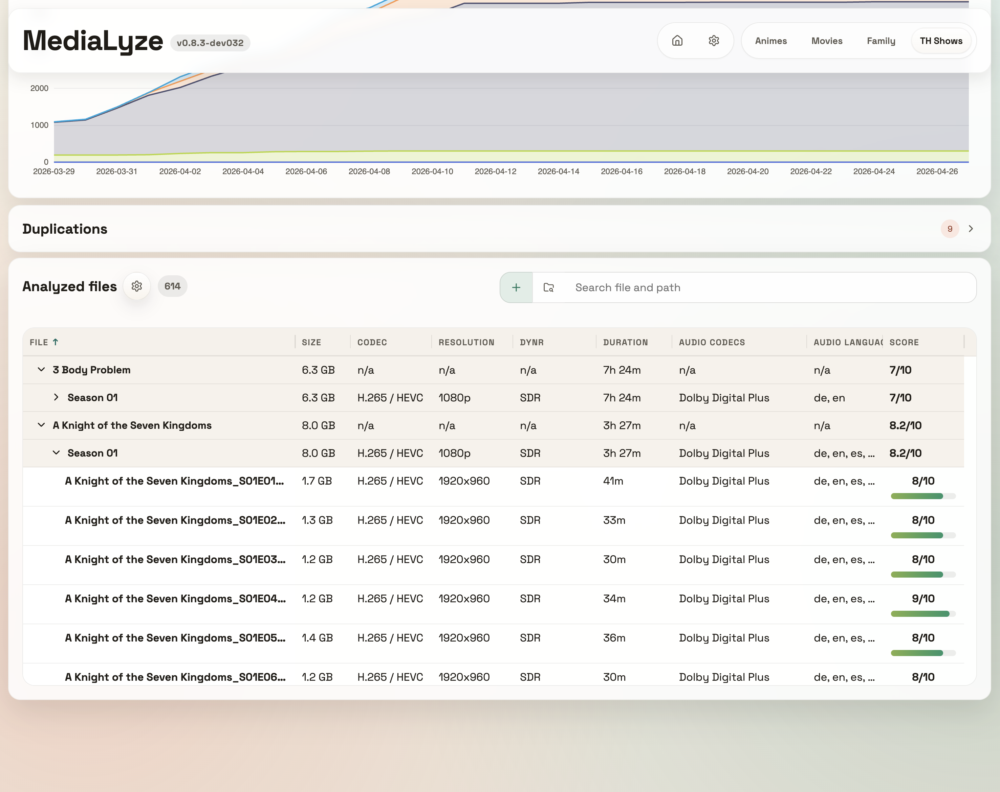

# MediaLyze

<p align="center">
  <a href="./LICENSE"></a>
  
  
  
  
  
  
</p>

<p align="center">
  Self-hosted media library analysis for large video collections.
  Scans your libraries and run analyses using <code>ffprobe</code>.
  Explore technical metadata through a FastAPI + React web UI.
</p>

<p align="center">
  MediaLyze focuses (for now) on just analysis, not playback, scraping, or file modification, READ ONLY on your files!
</p>

## Desktop Downloads

| Platform | Download |
| --- | --- |
| macOS Apple Silicon | [Download](https://github.com/frederikemmer/MediaLyze/releases/latest/download/MediaLyze-arm64.dmg) |
| Linux | [Download](https://github.com/frederikemmer/MediaLyze/releases/latest/download/MediaLyze.AppImage) |
| Windows | [Download](https://github.com/frederikemmer/MediaLyze/releases/latest/download/MediaLyze.Setup.exe) |
| All release assets | [Open latest release](https://github.com/frederikemmer/MediaLyze/releases/latest) |


## Why MediaLyze

MediaLyze is built for self-hosted setups that need visibility into large media collections without depending on external services and designed around ffprobe with normalized metadata.

Everything with a simple deployment model: one container, one SQLite database, one UI.
Bring your own auth (for now).

## Features

- Technical media analysis powered by `ffprobe`
- Safe FFmpeg transcoding into linked video variants with hardware-required execution by default; original files remain untouched unless explicit replacement is confirmed
- Full and incremental scans using `path + size + mtime`
- historical analysis
- many different charts for all metrics
- Normalized formats, streams, subtitles, scan jobs, and quality scores (feel free to suggest improvements)
- recognize shows, seasons, bonus content
- Ignore files and folders with simple glob patterns such as `*.nfo` or `*/Extras/*`
- Native desktop packaging for Windows, macOS, and Linux in addition to the Docker/web deployment path
- and more

## Screenshots

<table>
  <tr>
    <td></td>
    <td></td>
    <td></td>
  </tr>
  <tr>
    <td></td>
  </tr>
</table>

## Support MediaLyze

If you find MediaLyze useful and would like to support ongoing development, you can do so here:

[](https://www.paypal.com/donate/?hosted_button_id=DEINE_PAYPAL_BUTTON_ID)
[](https://github.com/sponsors/frederikemmer)
[](https://www.buymeacoffee.com/medialyze)

## Quick Start

### Docker Compose

use the production ready docker compose file:
[docker-compose.yaml](docker/docker-compose.yaml)

```docker
services:
  medialyze:
    image: ghcr.io/frederikemmer/medialyze:latest
    container_name: medialyze
    ports:
      - "${HOST_PORT:-8080}:8080"
    environment:
      # change to your timezone, e.g. "Europe/Berlin" or "America/New_York"
      TZ: UTC
    volumes:
      - ./config:/config
      # use .env or change "./media" to the path of your media directory
      - ./media:/media:ro

      # additional media mounts by extending this pattern if needed:
      # /PATH/TO/MEDIA0:/media/MEDIA0:ro
      # /PATH/TO/MEDIA1:/media/MEDIA1:ro
```

can be extended by .env using:
[docker-compose-ENV.yaml](docker/docker-compose-ENV.yaml)
and 
[env.example](docker/env.example)

For automatic local GPU wiring, use `docker/start-medialyze.sh` on Linux/macOS
or `docker/start-medialyze.ps1` on Windows. The launcher starts the CPU-safe
Compose file and creates a temporary override for NVIDIA (`gpus: all`) and
Linux `/dev/dri` plus the host device-group IDs only when the corresponding
host capability is present. It does not install drivers. MediaLyze then probes
the visible encoders and selects a passing AMD, Intel, or NVIDIA path without
requiring a vendor-specific setting. The media mount remains read-only;
transcoded output is written to `./Transcode_Output` by default and can be
moved with `TRANSCODE_OUTPUT_HOST_DIR`.

This includes integrated media engines: Intel CPU/iGPU Quick Sync and AMD APU/iGPU VCN
on Linux through `/dev/dri`, plus native Windows QSV/AMF and macOS VideoToolbox in the
desktop app. A CPU software encoder is used only in the explicit `cpu_only` mode.


Open `http://localhost:8080`, or set `HOST_PORT` to expose the container on a different host port.
The container serves plain HTTP on its internal port `8080` by default - if you want HTTPS, terminate it in a reverse proxy.

#### Configuration through [Docker configuration](#docker-configuration)

---

### Desktop app

Built with Electron, desktop builds run the same FastAPI + React stack locally with a local SQLite database and `ffprobe`.

Desktop behavior:

- choose local folders directly from the OS
- choose mounted NAS / SMB locations and, on Windows, UNC paths such as `\\server\share\videos`
- watch mode is limited to local paths; network paths fall back to scheduled scans

Release artifacts are packaged as:

- Windows: `.exe`
- macOS: `.dmg`
- Linux: `AppImage`

---

### Build locally

run:
```bash
cp docker/env.example .env
docker compose -f docker-compose-dev.yaml up --build
```

The default container setup mounts:

- `./config` to `/config`
- `./media` to `/media` as read-only

If you want a different media-path, or external port change `env.example` or `.env`.

## Local Development

For a single-command local dev setup, use `scripts/dev-local.sh` on macOS/Linux or `scripts/dev-local.ps1` on Windows.

### Backend

```bash
python3 -m venv .venv
source .venv/bin/activate
pip install -e .[dev]
uvicorn backend.app.main:app --reload --port 8080
```

### Frontend

```bash
cd frontend
npm install
npm run dev
```

The Vite dev server proxies `/api` to `http://127.0.0.1:8080`.

### Combined startup scripts

macOS/Linux:

```bash
./scripts/dev-local.sh
```

Windows PowerShell:

```powershell
.\scripts\dev-local.ps1
```

Both scripts expect:

- `.venv` with `pip install -e .[dev]`
- `frontend/node_modules` from `npm --prefix frontend install`
- a valid `MEDIA_ROOT` directory, defaulting to your Desktop if not overridden

They start the backend with reload enabled, wait for `/api/health`, then launch the Vite dev server in the foreground.

### Desktop

```bash
python3 -m venv .venv
source .venv/bin/activate
pip install -e .[dev]

cd frontend
npm install
npm run build

cd ../desktop
npm install
npm run dev
```

Local desktop development expects `ffprobe` in your `PATH`.
For packaged `.app`, `.dmg`, `.exe`, and `AppImage` builds, see [docs/build_desktop.md](docs/build_desktop.md).

## Docker configuration

Relevant environment variables:

- `MEDIALYZE_RUNTIME`: runtime mode, `server` or `desktop`, default `server`
- `CONFIG_PATH`: writable config/data directory, default `/config` in server mode and the OS user-data directory in desktop mode
- `MEDIA_ROOT`: media mount root for server mode, default `/media`
- `APP_HOST`: bind host for the backend, default `0.0.0.0` in server mode and `127.0.0.1` in desktop mode
- `HOST_PORT`: HTTP port exposed on the host by the provided Docker Compose files, default `8080`; access the app via `http://<host>:<HOST_PORT>`
- `FRONTEND_DIST_PATH`: optional explicit frontend bundle path, mainly used by packaged desktop builds
- `TZ`: process/container timezone, default `UTC`
- `DISABLE_DEFAULT_IGNORE_PATTERNS`: optional; when set to `true`, built-in default ignore patterns are not preloaded
- `MEDIALYZE_TELEMETRY_DISABLED`: optional; when set to `true`, telemetry is forced off and the UI toggle is locked
- `MEDIALYZE_TELEMETRY_ENDPOINT`: optional; overrides the telemetry ingest endpoint, default `https://www.medialyze.app/api/telemetry/ingest`
- `FFPROBE_PATH`: optional override for the `ffprobe` binary path
- `FFMPEG_PATH`: optional override for the `ffmpeg` binary used for preview generation and transcoding
- `MEDIALYZE_TRANSCODE_OUTPUT_ROOT`: optional writable path inside the runtime for separate transcoded output; Compose maps this to `/transcode-output`
- `MEDIALYZE_HW_RENDER_NODE`: optional Linux DRM render node override for Intel/AMD VAAPI/QSV, for example `/dev/dri/renderD128`; when omitted MediaLyze probes every visible render node and selects a passing device automatically
- `TRANSCODE_OUTPUT_HOST_DIR`: Compose host directory for `/transcode-output`, default `./Transcode_Output`
- `JELLYFIN_API_KEY_FILE`: optional path to a Jellyfin API-key secret file; see [Jellyfin integration](docs/jellyfin.md)
- `PUID` / `PGID`: optional runtime user/group ids for shared-folder permission setups; set both or leave both unset to keep the default root runtime user

`MEDIA_ROOT` should be mounted read-only in production.

If you need a specific runtime uid/gid, set `PUID` and `PGID` in `.env`. The compose files already load `.env`, so no compose changes are required.

For SMB / NAS setups, the recommended approach is to mount the share on the Docker host first and then point `MEDIA_HOST_DIR` at that host mount path.
In the desktop app, mounted network shares and UNC paths can be selected directly.

Scan parallelism is configured in the UI under `Settings -> App settings -> Scan performance`.
MediaLyze exposes separate limits for per-scan analysis workers and parallel library scans so you can tune throughput without editing compose or env files.

Transcoding is configured under `Settings -> Transcoding`. Hardware-required is
the default and never falls back silently to CPU. The page shows the real
FFmpeg capability probe, including NVIDIA driver/API failures, and lets you
choose the CPU budget, GPU slots, output policy, retry behavior, and partial
output cleanup. Same-directory variants are excluded from primary counts and
future scans; replacing an original is an explicit, no-backup operation.
Desktop FFmpeg artifacts and Docker's architecture-specific FFmpeg package are
pinned and checksummed in [docs/ffmpeg-manifest.json](docs/ffmpeg-manifest.json).

Ignore rules use glob patterns matched against the normalized relative path inside each library. MediaLyze ships editable built-in defaults for common system and temporary paths such as `*/.DS_Store`, `*/@eaDir/*`, `*/.deletedByTMM/*`, and `*.part`. Set `DISABLE_DEFAULT_IGNORE_PATTERNS=true` if you do not want those defaults preloaded on first start.
See [docs/patterns.md](docs/patterns.md) for folder discovery, series recognition, bonus-content rules, and ignore-pattern examples.

Telemetry payloads are documented in [docs/telemetry.md](docs/telemetry.md), including the `none`, `minimal`, and `enabled` payload contracts and the privacy-preserving rounding rules for coarse usage counts.

Provider-neutral connections, conservative automatic path inference, automatic/manual library assignment, synchronization, and provider development are documented in [docs/connectors.md](docs/connectors.md). Jellyfin-specific permissions, playback-data privacy, compatibility, and secret handling are documented in [docs/jellyfin.md](docs/jellyfin.md). `JELLYFIN_API_KEY_FILE` applies only to the migrated standard Jellyfin connection; additional Jellyfin servers can be configured in the shared Connector Settings accordions. Remaining read-only diagnostics stages are tracked in [docs/connector-ui-deferred.md](docs/connector-ui-deferred.md).

Repository automation, Docker and desktop publishing, manual workflow controls, and release recovery are documented in [docs/github_actions.md](docs/github_actions.md).

## Tech Stack

- Backend: Python, FastAPI, SQLAlchemy, SQLite
- Frontend: React, Vite, TypeScript, i18next
- Desktop packaging: Electron, electron-builder
- Media analysis: `ffprobe` / FFmpeg
- Scheduling and watch mode: APScheduler, watchdog
- Packaging: GHCR

## Project Status

MediaLyze is an open-source project under active development. The current focus is technical media analysis for large self-hosted libraries, with the v1 scope centered on scanning, normalization, statistics, and file inspection.

### mentioned on

>[selfh.st](https://selfh.st/weekly/2026-03-13/)\
>[ServersatHome](https://www.youtube.com/watch?v=LU5q0GzsAIk)

## Star History

[](https://star-history.dera.page/#frederikemmer/medialyze&type=date&legend=top-left)

## Contributing

Contributions are welcome. Read [CONTRIBUTING.md](CONTRIBUTING.md) before opening a pull request.

## License

MediaLyze is licensed under the GNU Affero General Public License v3.0 (`AGPL-3.0`).
See the [LICENSE](LICENSE) file for details.
