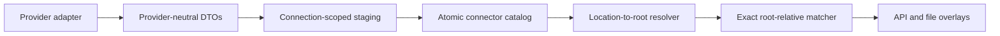

# Architecture Notes

## Backend

- `backend/app/main.py` boots FastAPI, initializes SQLite, and serves the built frontend.
- `backend/app/models/entities.py` contains the normalized schema required for library, format, stream, and scan-job tracking.
- `backend/app/services/scanner.py` performs deterministic discovery and parallel `ffprobe` execution.
- `backend/app/services/transcoding.py` validates versioned structured plans, discovers and smoke-tests FFmpeg encoders/devices, builds shell-free argument lists, publishes according to the explicit output policy, and reconciles analyzed files with persistent variant groups.
- `backend/app/services/connector_contract.py` defines the provider-neutral adapter boundary and DTOs.
- `backend/app/services/connector_sync.py` owns connection-scoped staging, atomic promotion, cancellation, and recovery.
- `backend/app/services/connector_mapping.py` infers conservative connection-scoped mapping rules, while `connector_pathing.py` and `connector_matching.py` resolve them to stable root-relative file identities.

## Frontend

- The UI is a small React SPA built with Vite.
- Routing is client-side; the backend serves `index.html` for deep links.
- `frontend/globals.css` provides the design language, extended by `frontend/src/medialyze.css`.

## Data flow

1. A library is created from a browsed path under `MEDIA_ROOT`.
2. A scan job traverses the filesystem and updates `media_files`.
3. New or changed files are analyzed with `ffprobe`.
4. Normalized rows are stored and aggregated for dashboard/detail endpoints.

## Transcoding data flow

1. A regular video file receives an editable profile-derived, structured plan.
2. Server-side validation resolves the source and target below the library root, verifies stream/container/encoder compatibility, and persists the exact normalized plan and command.
3. `ScanRuntimeManager` runs the job on a dedicated transcode executor with CPU-budget and per-device GPU slots; scan workers remain available for discovery and analysis.
4. FFmpeg writes to a hidden temporary file beside the target. Cancellation, failure, or a changed source removes that temporary output.
5. Successful output is published without replacing an existing path, except for the explicit confirmed replacement mode; then an incremental scan with trigger `transcode` analyzes same-directory output.
6. Reconciliation attaches the resulting `MediaFile` to the durable `TranscodeVariantGroup`, while same-directory variants are excluded from primary queries and later scans. Pruning job history never deletes output media or variant relationships.

The complete contract, safety invariants, profiles, and API are documented in [Transcoding](transcoding.md).

## Connector data flow

External catalogs use the architecture documented in [connectors.md](connectors.md):

The connector core owns connections, provider descriptors, credentials, remote catalogs, mapping inference, synchronization, background recompute jobs, and exact-path matches. Provider adapters own transport and response normalization. The inference step derives only transformations supported by a conservative multi-asset corpus; it never persists file candidates. The matcher prepares bindings once, persists resolved root locators, and performs bulk indexed matching. The MediaLyze scanner remains the sole owner of local paths and file identities and reports pre/post root locators so additions, deletions, and renames enqueue connector remapping on the dedicated executor. Jellyfin image behavior remains a provider-specific compatibility extension during the first connector release.
